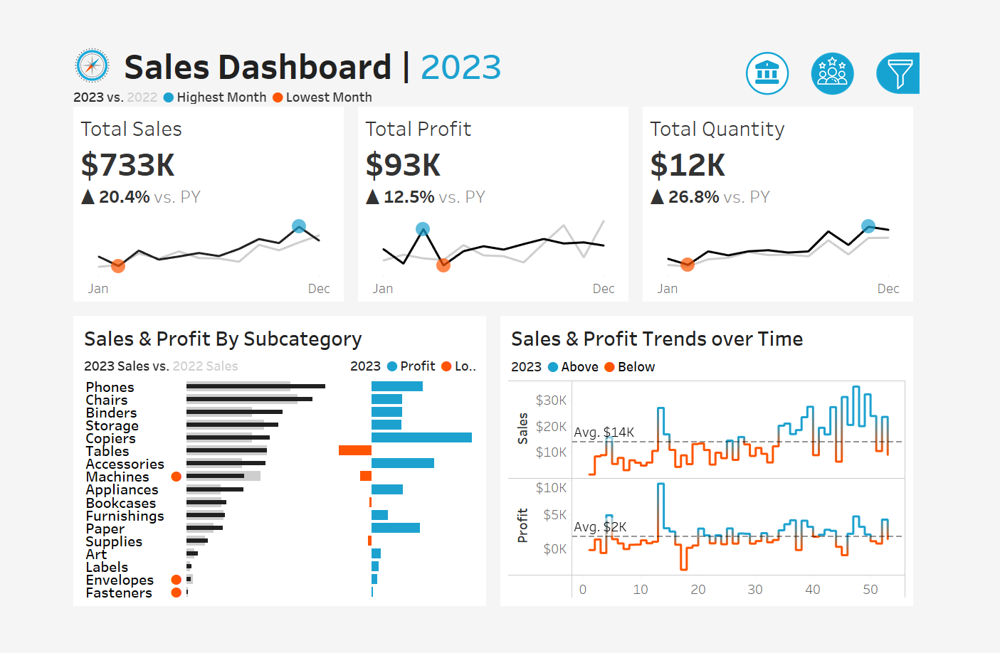
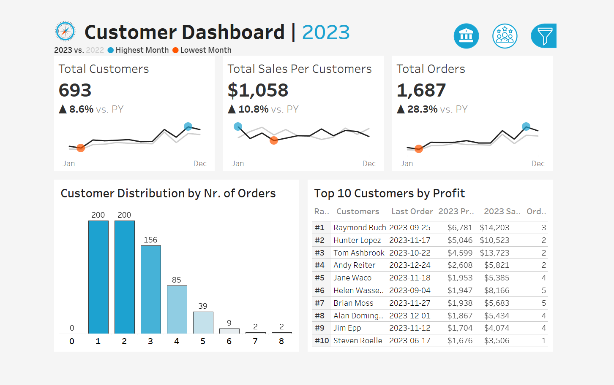

# Sales & Customer Analytics Dashboards (Tableau)

## Overview
This project delivers two interactive Tableau dashboards—**Sales Performance** and **Customer Insights**—designed to help business stakeholders analyze year-over-year performance, identify trends, and understand customer behavior.

The project simulates a real-world analytics engagement, covering the full lifecycle from business requirements and KPI definition to dashboard design and implementation.

---

## Business Objective
Enable executives, sales managers, and marketing teams to:
- Monitor sales, profit, and volume performance over time
- Compare current-year results against the previous year
- Identify top-performing products and customers
- Understand customer purchasing behavior and engagement patterns

---

## Project Scope & Requirements
The dashboards were developed based on a clearly defined user story and functional requirements to mirror how analytics solutions are scoped in real business environments.

📄 Full documentation:
- [Project Requirements & User Stories](docs/project_requirements.md)

---

## Dashboards Included

### 📊 Sales Dashboard
**Purpose:**  
Provide a high-level overview of sales performance and trends to support strategic and operational decision-making.

**Key Features:**
- Executive KPI overview:
  - Total Sales
  - Total Profit
  - Total Quantity Sold
  - Year-over-year comparison
- Monthly trends for sales, profit, and quantity (Current Year vs Previous Year)
- Clear identification of highest and lowest performing months
- Sales and profit comparison by product subcategory
- Weekly sales and profit analysis:
  - Average weekly benchmarks
  - Highlighted weeks above and below average

📸 **Preview:**  


---

### 👥 Customer Dashboard
**Purpose:**  
Provide insights into customer behavior, value, and engagement to support marketing strategy and customer retention initiatives.

**Key Features:**
- Executive KPI overview:
  - Total Customers
  - Total Sales per Customer
  - Total Orders
  - Year-over-year comparison
- Monthly customer and sales trends
- Customer distribution by number of orders to assess engagement and loyalty
- Top 10 customers ranked by profit, including:
  - Rank
  - Number of orders
  - Sales
  - Profit
  - Last order date

📸 **Preview:**  


---

## Design & Interactivity
Both dashboards were designed with executive usability and clarity in mind.

**Interactivity includes:**
- Dynamic year selection for historical analysis
- Interactive charts that act as filters
- Seamless navigation between Sales and Customer dashboards

**Available Filters:**
- Product Category
- Product Subcategory
- Region
- State
- City

---

## Data & Metrics
- Data grain: Daily
- Comparison logic: Current Year vs Previous Year
- Metrics are defined consistently across dashboards to ensure accuracy and trust

📄 Metric definitions are documented in:
- [Metric Definitions](metrics/metric_definitions.md)

---

## Key Insights (Sample)
- Sales increased year-over-year, driven primarily by growth in high-volume product subcategories.
- A relatively small group of repeat customers generated a disproportionate share of total profit.
- Weekly sales and profit variability highlights opportunities for improved promotion timing and inventory planning.

---

## Tools & Stack
- **BI Tool:** Tableau
- **Data Preparation:** SQL
- **Data Model:** Analytics-ready fact and dimension tables
- **Documentation:** GitHub Markdown

---

## Repository Structure
```text
├── dashboards/        # Tableau workbooks
├── images/            # Dashboard screenshots
├── docs/              # Project requirements & documentation
├── metrics/           # KPI definitions
└── mockups/           # Dashboard wireframes
